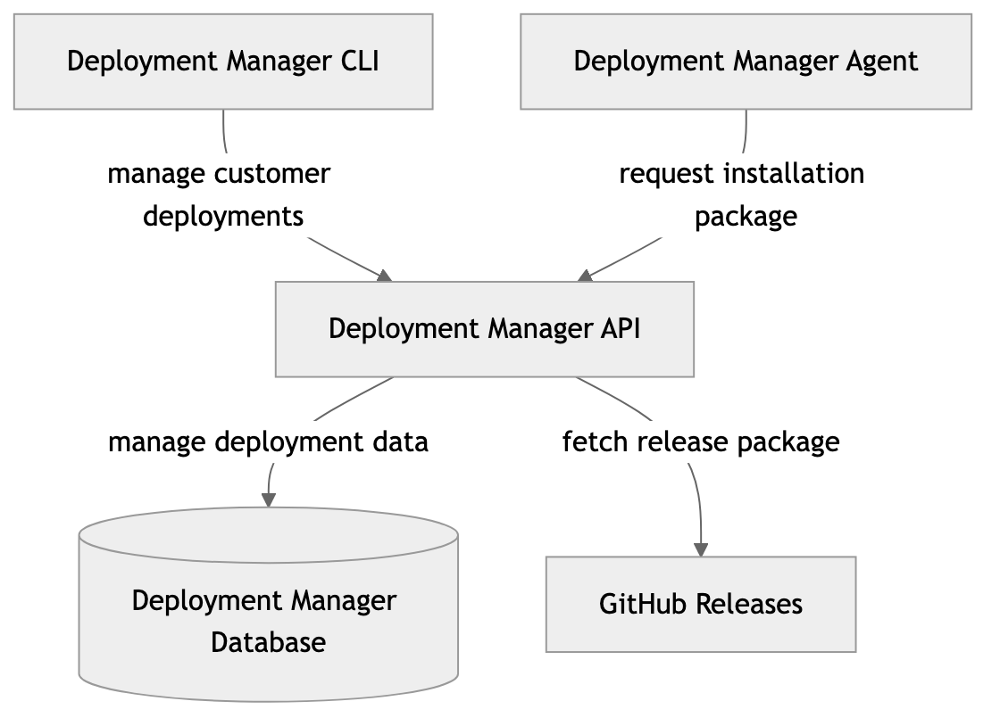
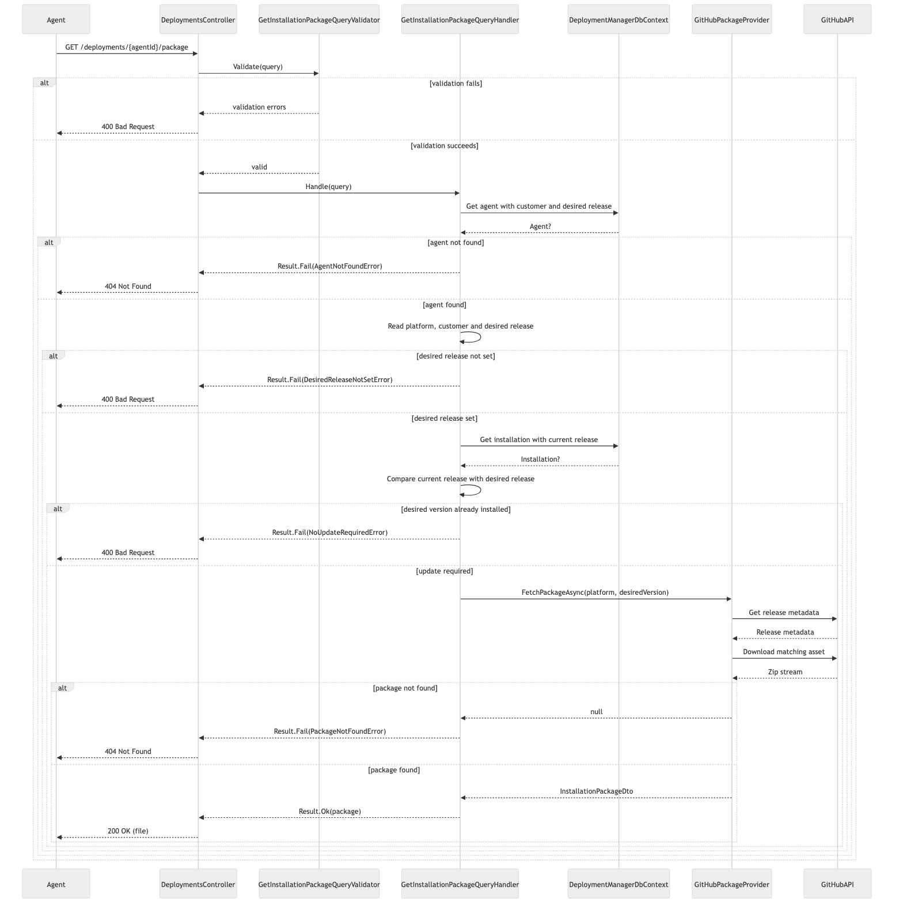
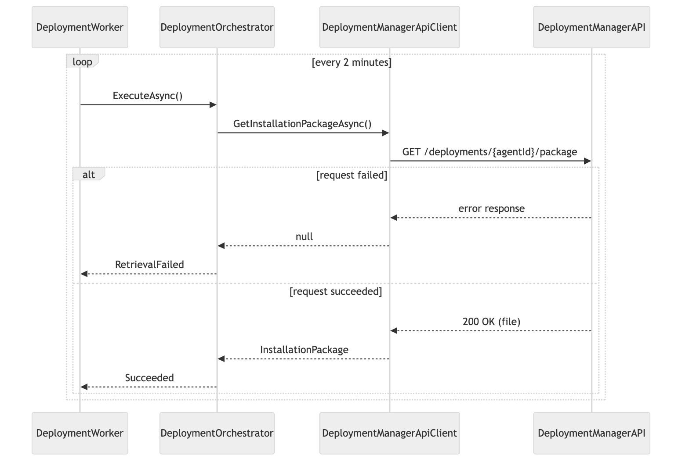
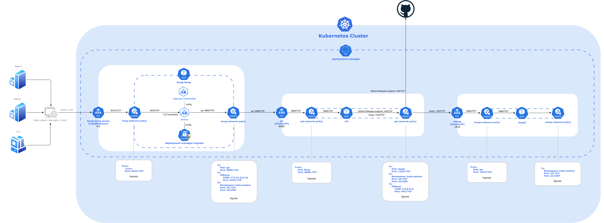

# Distributed Deployment System
A distributed system for automated deployment of software releases to customers.

## Architecture Overview
The system consists of three main applications:
- **Deployment Manager API:** Stores and manages deployments
- **Deployment Manager CLI:** Used internally to inspect and update deployments
- **Deployment Manager Agent:** Runs in the customer environment and installs the desired version when a change is detected

<picture>
  <source media="(prefers-color-scheme: dark)" srcset="docs/diagrams/system-architecture-overview-dark.png">
  
</picture>

---
## Systems

### Deployment Manager API
API responsible for managing deployment state and coordinating release deployments. Exposes endpoints for reading and updating each customer's current and desired software version, and retrieves new releases from GitHub when requested.

#### API Contract
##### Endpoints
```https
GET /api/Deployments/{agentId}/package
```

##### Parameters
| Parameter | Type | Description |
|-----------|------|-------------|
| agentId | uuid | Public identifier of the agent |

##### Responses
| Status | Description |
|--------|-------------|
| 200 OK | Returns installation package |
| 400 Bad Request | Invalid request, no update required, or no desired version set |
| 404 Not Found | Agent or package not found |

#### Feature: Retrieve Installation Package
> The following diagrams show only components relevant to the feature. Framework components are omitted for clarity.

##### Design
<picture>
  <source media="(prefers-color-scheme: dark)" srcset="docs/diagrams/api-design-class-diagram-dark.png">
  
</picture>

##### Flow
<picture>
  <source media="(prefers-color-scheme: dark)" srcset="docs/diagrams/api-sequence-diagram-dark.png">
  
</picture>

### Deployment Manager CLI
CLI used internally to manage deployments. Shows the current and desired software version for each customer and allows update of desired version.

### Deployment Manager Agent
Background worker that periodically checks for changes in the customer's desired software version, comparing it with the currently installed version, and when mismatch is detected, retrieves, downloads and installs a new release.

#### Feature: Retrieve Installation Package
> The following diagrams show only components relevant to the feature. Framework components are omitted for clarity.

##### Design
<picture>
  <source media="(prefers-color-scheme: dark)" srcset="docs/diagrams/agent-design-class-diagram-dark.png">
  
</picture>

##### Flow
<picture>
  <source media="(prefers-color-scheme: dark)" srcset="docs/diagrams/agent-sequence-diagram-dark.png">
  
</picture>

---
## CI/CD Pipeline
Each application has its own CI/CD pipeline.

### API
<picture>
  <source media="(prefers-color-scheme: dark)" srcset="docs/diagrams/api-ci-cd-dark.png">
  
</picture>

### CLI
<picture>
  <source media="(prefers-color-scheme: dark)" srcset="docs/diagrams/cli-ci-cd-dark.png">
  
</picture>

### Agent
<picture>
  <source media="(prefers-color-scheme: dark)" srcset="docs/diagrams/agent-ci-cd-dark.png">
  
</picture>

---
## Local Deployment
> This setup has been developed and tested on macOS. Some commands may differ on other operating systems.

### Kubernetes

#### Kubernetes Network Architecture
<picture>
  <source media="(prefers-color-scheme: dark)" srcset="docs/diagrams/kubernetes-network-architecture-dark.png">
  
</picture>

#### DNS Configuration
Add local DNS entry for deployment-manager.local:
1. Open the hosts file:
   ```bash
   sudo vim /etc/hosts
   ```
2. Add host entry:
   ```bash
   172.21.0.4  deployment-manager.local
   ```
   Replace `172.21.0.4` with the actual `EXTERNAL-IP` of kong-kong-proxy, available after running local Kubernetes cluster the first time.
3. Save the file.

#### Environment Setup
1. Install Homebrew
2. Install kind, kubectl, and helm:
   ```bash
   brew install kind
   brew install kubectl
   brew install helm
   ```
3. Add kong and mssql helm charts to helm repo:
   ```bash
   helm repo add kong https://charts.konghq.com
   ```
   ```bash
   helm repo add emberstack https://emberstack.github.io/helm-charts
   ```
4. Install Go:
   ```bash
   brew install go
   ```
5. Install cloud-provider-kind:
   ```bash
   go install sigs.k8s.io/cloud-provider-kind@latest
   ```
6. Move cloud-provider-kind to /usr/local/bin for global use:
   ```bash
   sudo mv ~/go/bin/cloud-provider-kind /usr/local/bin/cloud-provider-kind
   ```

#### Configure Secrets
Create `secret.yaml` from each `secret.yaml.tpl` and replace placeholder values with real secrets.

#### Run Local Kubernetes Cluster
> Commands must be executed from the repository root.  
> Docker Desktop must be running as kind relies on Docker to create the cluster.
1. Create the Kubernetes cluster:
   ```bash
   kind create cluster --config k8s/kind-calico.yaml
   ```
2. Apply the calico CNI manifest:
   ```bash
   kubectl apply -f https://raw.githubusercontent.com/projectcalico/calico/v3.27.3/manifests/calico.yaml
   ```
3. Create namespace:
   ```bash
   kubectl apply -f k8s/namespace.yaml  
   ```
4. Create self-signed TLS certificate for deployment-manager.local:
   ```bash
   openssl req -x509 -nodes -days 365 -newkey rsa:2048 -keyout k8s/kong/kong-tls.key -out k8s/kong/kong-tls.crt -config k8s/kong/san.cnf -extensions req_ext
   ```
5. Create TLS secret for Kong:
    ```bash
    kubectl create secret tls kong-ingress-tls --cert=k8s/kong/kong-tls.crt --key=k8s/kong/kong-tls.key -n deployment-manager
    ```
6. Install Kong Helm chart with `values.yaml` to enable Ingress Controller mode and TLS:
   ```bash
   helm install kong kong/kong -n deployment-manager -f k8s/kong/values.yaml
   ```
7. Apply ingress:
   ```bash
   kubectl apply -f k8s/kong/ingress.yaml
   ```
8. Open `Keychain Access`.  
9. Select `System` → `Certificates`.  
10. Drag `kong-tls.crt` into the certificate list.  
11. Double-click the imported certificate → expand `Trust` → set `When using this certificate` to `Always Trust`.  
12. Apply MSSQL secret:
    ```bash
    kubectl apply -f k8s/mssql/secret.yaml  
    ```
13. Install MSSQL Helm chart:
    ```bash
    helm install mssql emberstack/mssql -n deployment-manager -f k8s/mssql/values.yaml  
    ```
14. Apply network policies:
    ```bash
    kubectl apply -f k8s/kong/network-policy.yaml  
    kubectl apply -f k8s/mssql/network-policy.yaml  
    ```
15. Apply application manifests:
    ```bash
    kubectl apply -f k8s/api  
    ```
    *If errors occur, simply run the command again. Sometimes manifests are applied out of order, so dependent resources may not exist the first time.*
16. Verify that all pods are running:
    ```bash
    kubectl get pods -A
    ```
17. Start cloud-provider-kind:
    ```bash
    sudo /usr/local/bin/cloud-provider-kind
    ```
    *This assigns an external IP to the Kong LoadBalancer service that allows it to be accessed from outside the Kubernetes cluster.*

**Cleanup:**  
Remove the kind cluster:
```bash
kind delete cluster
```

> Any MSSQL data will be lost once the cluster is deleted

### Agent
#### Configure Environment Variables
```bash
export AgentIdentity__ApiKey="<api-key>"
```

#### Run Agent
> Command must be executed from the repository root.  
```bash
dotnet run --project DeploymentManager.Agent/DeploymentManager.Agent.csproj
```

---
## Related repository
Demo updatable console application can be found at [demo-updatable-app](https://github.com/annafoldberg/demo-updatable-app).

---
## Sources
README details: Descriptions and configuration details partially adapted from previous personal README at [infra-core](https://github.com/Team-2-Devs/infra-core/tree/main)  
Kong Helm chart: https://artifacthub.io/packages/helm/kong/kong  
MSSQL Helm chart: https://artifacthub.io/packages/helm/emberstack/mssql